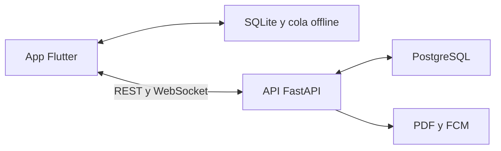

<p align="center">
  
</p>

<h1 align="center">CheckTap</h1>

<p align="center">
  Gestión colaborativa de tareas, diseñada para seguir funcionando incluso cuando la conexión no está disponible.
</p>

## Descripción

CheckTap es una aplicación móvil *offline-first* para organizar el trabajo por departamentos. Permite crear, asignar y dar seguimiento a tareas y listas de verificación desde Android, mantener los cambios en una base local y sincronizarlos automáticamente con un servidor FastAPI cuando vuelve la conexión.

El sistema puede desplegarse dentro de la red local de una organización mediante Docker o Portainer. Las notificaciones Firebase son opcionales y no condicionan el funcionamiento principal de las tareas.

## Funcionalidades principales

- Autenticación mediante JWT y almacenamiento seguro de la sesión.
- Gestión de usuarios, administradores, departamentos y membresías.
- Tareas con prioridad, estado, descripción y múltiples responsables.
- Listas de verificación con elementos y progreso independiente.
- Caché SQLite, cola de operaciones y trabajo sin conexión.
- Sincronización automática con reintentos, idempotencia y control de conflictos.
- Actualizaciones en tiempo real mediante WebSocket.
- Notificaciones push con Firebase Cloud Messaging, cuando están habilitadas.
- Informes diarios en PDF para consulta y uso compartido.
- Permisos según administrador, creador y pertenencia al departamento.
- Interfaz responsive con soporte para tema claro y oscuro.

## Arquitectura



| Capa | Tecnologías |
| --- | --- |
| Aplicación móvil | Flutter, Dart, Dio, Workmanager |
| Persistencia móvil | SQLite, Shared Preferences, Flutter Secure Storage |
| Backend | FastAPI, Uvicorn, SQLAlchemy, Pydantic |
| Base de datos | PostgreSQL 17, Alembic |
| Tiempo real | WebSocket |
| Notificaciones | Firebase Cloud Messaging y notificaciones locales |
| Infraestructura | Docker Compose y Portainer |
| Calidad | Pytest, Ruff, Flutter Test y GitHub Actions |

## Estructura del repositorio

| Ruta | Contenido |
| --- | --- |
| `mobile/` | Aplicación Flutter, almacenamiento local, sincronización y pruebas |
| `backend/` | API FastAPI, modelos, servicios, migraciones y pruebas |
| `deploy/` | Configuración de Docker Compose y despliegue con Portainer |
| `scripts/` | Preparación, ejecución, validación y pruebas locales |
| `docs/` | Documentación técnica, arquitectura de interfaz y QA |
| `.github/workflows/` | Integración continua de la aplicación móvil |

## Requisitos

- Linux o Ubuntu recomendado.
- Python 3.12 o superior, con soporte para entornos virtuales.
- Docker Engine y Docker Compose Plugin.
- Flutter estable compatible con Dart 3.9 o superior.
- Android SDK y Java 17 para ejecutar o compilar la aplicación Android.

## Inicio rápido en desarrollo

Desde la raíz del repositorio, prepara PostgreSQL, el entorno virtual, las dependencias y las migraciones:

```bash
chmod +x scripts/*.sh
./scripts/setup_local.sh
```

Inicia la API con recarga automática:

```bash
./scripts/run_backend_local.sh
```

Servicios disponibles:

| Servicio | URL |
| --- | --- |
| API | `http://localhost:8000` |
| Swagger | `http://localhost:8000/docs` |
| Estado del sistema | `http://localhost:8000/health` |
| PostgreSQL local | `localhost:5433` |

Credenciales iniciales de desarrollo:

```text
Correo: admin@checktap.com
Clave:  Admin123!
```

> Estas credenciales son únicamente para desarrollo. Modifícalas antes de exponer el servidor en una red compartida o entorno productivo.

## Ejecutar la aplicación móvil

Instala las dependencias:

```bash
cd mobile
flutter pub get
```

Elige la URL según el dispositivo:

| Entorno | `API_BASE_URL` |
| --- | --- |
| Emulador Android | `http://10.0.2.2:8000` |
| Dispositivo Android por USB con `adb reverse` | `http://127.0.0.1:8000` |
| Dispositivo conectado a la red local | `http://IP_DEL_SERVIDOR:8000` |

Ejemplo para el emulador Android:

```bash
flutter run --dart-define=API_BASE_URL=http://10.0.2.2:8000
```

Para usar un dispositivo por USB:

```bash
adb reverse tcp:8000 tcp:8000
flutter run --dart-define=API_BASE_URL=http://127.0.0.1:8000
```

## Funcionamiento sin conexión

El primer inicio de sesión requiere acceso al servidor. Después de la primera sincronización, CheckTap conserva la sesión y los datos necesarios en el dispositivo.

Cuando no hay conexión:

1. La aplicación carga la información almacenada localmente.
2. Los cambios en tareas y listas de verificación se registran en una cola SQLite.
3. Al recuperar la conexión, las operaciones se envían en orden y se actualiza la caché.
4. Si el servidor detecta un conflicto de versión, su versión confirmada prevalece y la aplicación informa al usuario.

Cerrar sesión elimina la autorización local; el siguiente ingreso vuelve a requerir conexión.

## Pruebas y calidad

Backend:

```bash
./scripts/test_local_backend.sh
```

Aplicación móvil:

```bash
./scripts/run_mobile_qa.sh
```

La validación móvil ejecuta formato, análisis estático y pruebas unitarias y de widgets. El flujo de GitHub Actions también genera un APK Android de depuración como artefacto de CI.

## Ejecutar el stack completo con Docker

Crea la configuración local y reemplaza las claves y contraseñas de ejemplo:

```bash
cp deploy/.env.example deploy/.env
```

Después inicia PostgreSQL y la API:

```bash
./scripts/start_local.sh
```

En este modo, la API queda disponible en `http://localhost:8080`.

Para un servidor de red local administrado con Portainer, consulta la [guía de despliegue](deploy/portainer/README_PORTAINER.md).

> La administración actual de conexiones WebSocket vive en memoria. Mantén una sola réplica y un solo worker de la API; para escalar horizontalmente será necesario incorporar un mecanismo compartido como Redis Pub/Sub.

## Configuración importante

| Variable | Propósito |
| --- | --- |
| `DATABASE_URL` | Conexión de SQLAlchemy a PostgreSQL |
| `JWT_SECRET` | Firma de los tokens de acceso |
| `ACCESS_TOKEN_MINUTES` | Duración de la sesión |
| `CORS_ORIGINS` | Orígenes autorizados para consumir la API |
| `BOOTSTRAP_ADMIN_*` | Datos del administrador inicial |
| `REPORT_TIMEZONE` | Zona horaria usada en los informes |
| `DAILY_REPORT_TIME` | Hora de generación del informe diario |
| `FIREBASE_ENABLED` | Activa o desactiva las notificaciones push |

No publiques archivos `.env`, credenciales privadas de Firebase, copias de seguridad ni bases de datos locales.

## Documentación adicional

- [Desarrollo local](LOCAL_DEVELOPMENT.md)
- [Cliente Flutter](mobile/README.md)
- [Checklists](docs/CHECKLISTS_V0_11.md)
- [Arquitectura de interfaz](docs/CHECKTAP_UI_ARCHITECTURE.md)
- [Guía de mantenimiento de UI](docs/CHECKTAP_UI_MAINTENANCE.md)
- [QA móvil](docs/CHECKTAP_MOBILE_QA.md)
